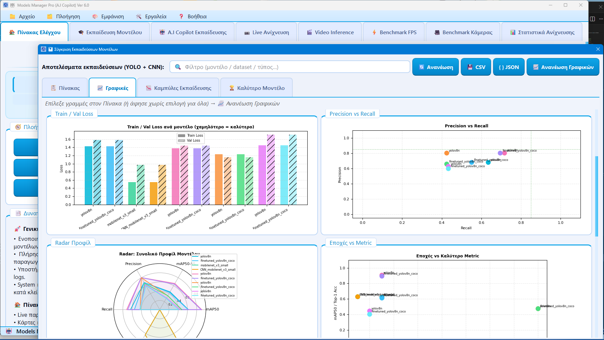

# Models-Manager-Pro v4.0
Models Manager Pro v4.0 (A.I. Copilot Edition) is a unified desktop platform designed for the complete management of YOLO (v5–v12) and CNN (torchvision) computer vision models
. Built using the PySide6 framework, the application provides a modern graphical interface for handling the entire machine learning pipeline, from training and optimization to live deployment and statistical analysis.
Video demo of the new application under development in version 6.0 : https://drive.google.com/file/d/1OLzDfJ-37BzTueEmlOBkmEvD1N-RV-qM/view?usp=sharing

1. Comprehensive Model Support
The application supports a wide range of architectures:
YOLO Models: Full integration with the Ultralytics library for Object Detection and Classification, supporting versions from v5 up to v12
.
CNN Classifiers: Support for torchvision architectures, specifically MobileNet V2/V3 (Small and Large) and ResNet-50/101, using a native PyTorch training loop
.
2. Advanced Training & Optimization
Training is highly customizable, allowing users to configure epochs, batch size, image size, and specific optimizers like Adam, AdamW, and SGD
.
Triton Acceleration: For YOLO models on GPU, the app supports TorchInductor/Triton compilation with modes like "reduce-overhead" and "max-autotune" to significantly speed up training
.
A.I. Copilot: An intelligent assistant powered by the Groq LLM API analyzes training logs and hardware environment to suggest optimized hyperparameters
.
Dataset Management: It includes automatic dataset scanning and supports both YAML-based detection datasets and ImageFolder structures for classification
.
3. Multi-Backend Exporting
Models can be exported into various high-performance formats to suit different deployment needs:
ONNX: Industry-standard format for cross-platform inference
.
TensorRT (.engine): Optimized for NVIDIA GPUs with built-in signature management for reliable caching and validation
.
NCNN: Specifically for mobile and edge device deployment
.
4. Real-time Inference & Benchmarking
Live Camera Detection: Provides real-time inference from camera streams with specialized overlays, including confidence bars and rank badges for CNN classifications
.
Video File Inference: Allows frame-by-frame processing of video files (mp4, avi, etc.) with the option to save annotated outputs
.
Automated Benchmarking: Includes dedicated tools to measure and compare the FPS and latency of different backends (PyTorch, ONNX, TensorRT, NCNN) on the user's specific hardware
.
5. Evaluation & Comparative Analysis
Professional PDF Reports: Automatically generates detailed training and detection reports featuring Matplotlib charts for loss curves, accuracy/mAP progression, and class distribution
.
Comparison Dialog: A sophisticated analysis tool that compares multiple training runs using radar charts and ranking systems to recommend the "Best Model" based on seven distinct performance criteria
.
6. System Stability & Diagnostics
Resource Monitoring: Real-time tracking of CPU, RAM, and GPU usage
.
Robust Logging: Features advanced error handling, crash logs with full thread dumps, and a Python faulthandler for capturing low-level system crashes
.
UI Features: Supports Light/Dark theme toggling and adaptive UI scaling for different screen resolutions.
.
7.  Download full Installer: https://drive.google.com/drive/folders/1gC3sIyvGoJoRG75GcNWAmV5UnfHskoXg?usp=drive_link
.
# Models-Manager-Pro (Greek)

Το Models Manager Pro v4.0 (A.I. Copilot Edition), δημιουργία του Πεφάνη Ευάγγελου, αποτελεί μια ολοκληρωμένη desktop εφαρμογή για την πλήρη διαχείριση του κύκλου ζωής μοντέλων YOLO (v5–v12) και CNN (torchvision)
. Αναπτυγμένη με το framework PySide6, προσφέρει ένα σύγχρονο περιβάλλον εργασίας για την εκπαίδευση, βελτιστοποίηση, ανάλυση και ζωντανή χρήση μοντέλων υπολογιστικής όρασης
.
Ακολουθεί η αναλυτική περιγραφή των δυνατοτήτων της εφαρμογής:
1. Υποστήριξη Μοντέλων & Αρχιτεκτονικών
Μοντέλα YOLO: Πλήρης ενσωμάτωση της βιβλιοθήκης Ultralytics για ανίχνευση αντικειμένων (Object Detection) και ταξινόμηση (Classification), υποστηρίζοντας όλες τις εκδόσεις από v5 έως v12
.
Μοντέλα CNN (Classification): Υποστήριξη αρχιτεκτονικών του torchvision, όπως MobileNet V2/V3 (Small/Large) και ResNet-50/101, μέσω ενός native PyTorch training loop
.
2. Προηγμένη Εκπαίδευση & Βελτιστοποίηση
Πλήρης Παραμετροποίηση: Ρύθμιση υπερπαραμέτρων όπως εποχές (epochs), batch size, imgsz, optimizer (Adam, AdamW, SGD), ρυθμός μάθησης (LR), momentum και weight decay
.
Επιτάχυνση Triton: Υποστήριξη του TorchInductor/Triton για μοντέλα YOLO σε GPU, με λειτουργίες όπως «Μείωση επιβάρυνσης» (reduce-overhead) και «Μέγιστος αυτόματος συντονισμός» (max-autotune) για σημαντική αύξηση της ταχύτητας εκπαίδευσης
.
A.I. Copilot: Ένας έξυπνος βοηθός βασισμένος στο Groq LLM API, ο οποίος αναλύει τα logs εκπαίδευσης και το hardware του χρήστη για να προτείνει και να εφαρμόζει αυτόματα βελτιστοποιημένες ρυθμίσεις
.
Διαχείριση Datasets: Αυτόματη σάρωση καταλόγων, υποστήριξη αρχείων YAML (YOLO) και δομής ImageFolder (CNN)
.
3. Εξαγωγή Μοντέλων (Multi-Backend Export)
Η εφαρμογή επιτρέπει την εξαγωγή μοντέλων σε μορφές υψηλής απόδοσης
:
ONNX: Το βιομηχανικό πρότυπο για inference σε διάφορες πλατφόρμες.
TensorRT (.engine): Μέγιστη βελτιστοποίηση για κάρτες NVIDIA, με ενσωματωμένο σύστημα signatures για αξιόπιστη διαχείριση της cache
.
NCNN: Ειδικά σχεδιασμένο για χρήση σε mobile και edge συσκευές
.
4. Inference & Benchmarking σε Πραγματικό Χρόνο
Live Ανίχνευση: Χρήση κάμερας με στόχο τα 1080p και προηγμένα overlays. Στα CNN μοντέλα εμφανίζονται rank badges και μπάρες εμπιστοσύνης (confidence bars)
.
Video Inference: Επεξεργασία αρχείων βίντεο (mp4, avi κ.λπ.) frame-by-frame με δυνατότητα αποθήκευσης του αποτελέσματος με annotations
.
Auto-Benchmark: Ειδικά εργαλεία για τη μέτρηση των FPS και της καθυστέρησης (latency) σε όλα τα backends (PyTorch, ONNX, TensorRT, NCNN) πάνω στο υλικό του χρήστη
.
5. Αξιολόγηση & Συγκριτική Ανάλυση
Επαγγελματικές PDF Αναφορές: Αυτόματη παραγωγή αναλυτικών αναφορών εκπαίδευσης και ανίχνευσης με γραφήματα Matplotlib (Loss curves, Accuracy/mAP progression, Class distribution)
.
Διάλογος Σύγκρισης: Εργαλείο που αντιπαραβάλλει πολλαπλές εκπαιδεύσεις μέσω radar charts και βαθμολογεί τα μοντέλα βάσει 7 κριτηρίων για την ανάδειξη του «Καλύτερου Μοντέλου»
.
Στατιστικά Ανίχνευσης: Batch ανάλυση συνόλων εικόνων (έως 500) για τον εντοπισμό προβληματικών κλάσεων και τον υπολογισμό μέσου confidence και χρόνου inference
.
6. Σταθερότητα Συστήματος & Διαγνωστικά
Παρακολούθηση Πόρων: Live καταγραφή της χρήσης CPU, RAM και GPU στην αρχική οθόνη
.
Διαγνωστικά Utilities: Φόρμα που συγκεντρώνει πληροφορίες για το περιβάλλον συστήματος, τις εκδόσεις των βιβλιοθηκών και τη διαθεσιμότητα CUDA, με δυνατότητα εξαγωγής σε ZIP για troubleshooting
.
Theme & UI: Υποστήριξη Light/Dark theme και adaptive scaling για διαφορετικές αναλύσεις οθόνης
.
Crash Safety: Εξελιγμένο σύστημα καταγραφής crash logs (με thread dump) και χρήση faulthandler για τον εντοπισμό σφαλμάτων σε επίπεδο C.
.
7. Λήψη πλήρους προγράμματος εγκατάστασης: https://drive.google.com/drive/folders/1gC3sIyvGoJoRG75GcNWAmV5UnfHskoXg?usp=drive_link
